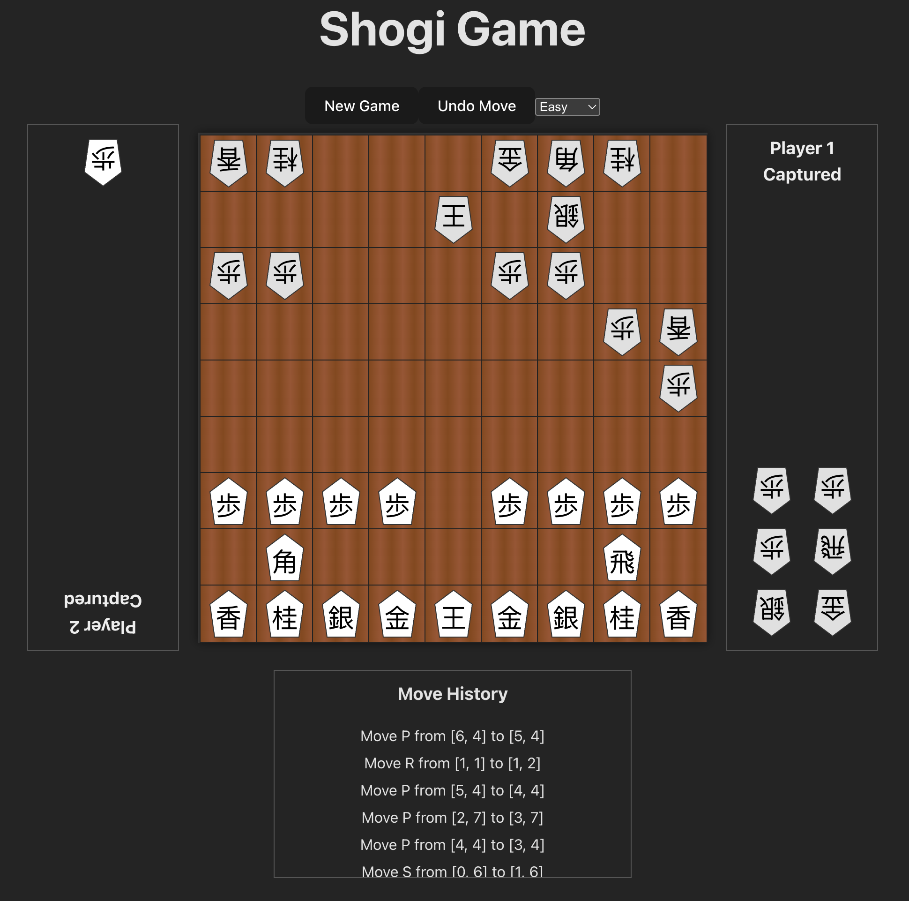

# Shogi Game (Vite + React)

This is a browser-based implementation of Shogi, also known as Japanese Chess. It allows a single player to play against a computer opponent with varying difficulty levels.

## Table of Contents
- [About Shogi](#about-shogi)
- [Rules of Shogi](#rules-of-shogi)
- [Piece Kanji Legend](#piece-kanji-legend)
- [Features](#features)
- [Getting Started](#getting-started)
- [WebAssembly Engine](#webassembly-engine)


## About Shogi
Shogi shares similarities with Western chess but has unique and fascinating differences, most notably the "drop" rule, where captured pieces can be brought back into play. This significantly changes the game's dynamics, making it a deeply strategic and complex game.



## Rules of Shogi

**1. The Board and Pieces:**
*   **Board:** Shogi is played on a 9x9 uncheckered board.
*   **Pieces:** Each player starts with 20 pieces:
    *   1 King (王将 / 玉将 - Ōshō / Gyokushō)
    *   2 Gold Generals (金将 - Kinshō)
    *   2 Silver Generals (銀将 - Ginshō)
    *   2 Knights (桂馬 - Keima)
    *   2 Lances (香車 - Kyōsha)
    *   1 Rook (飛車 - Hisha)
    *   1 Bishop (角行 - Kakugyō)
    *   9 Pawns (歩兵 - Fuhyō)
*   **Piece Identification:** Unlike Western chess, all pieces are the same color. They are differentiated by their shape (a pentagon, with the pointed end facing forward) and kanji (Japanese characters) written on them. Players tell their pieces from their opponent's by the direction they are pointing.

**2. Setup:**
Pieces are set up as follows, from the player's side:
*   **First Row (nearest to player):** Lance, Knight, Silver General, Gold General, King (center), Gold General, Silver General, Knight, Lance.
*   **Second Row:** Bishop (second square from left), Rook (second square from right).
*   **Third Row:** All nine Pawns.

**3. Objective:**
The goal of Shogi is to checkmate the opponent's King. This means placing the King in a position where it is under attack (in "check") and has no legal move to escape capture on the next turn.

**4. Movement of Pieces:**
Each piece has a unique way of moving and capturing:

*   **King (King):** Moves one square in any direction (horizontally, vertically, or diagonally).
*   **Gold General (Gold):** Moves one square orthogonally (forward, backward, left, right) or one square diagonally forward. It cannot move diagonally backward.
*   **Silver General (Silver):** Moves one square forward, or one square diagonally in any direction. It cannot move sideways or directly backward.
*   **Knight (Knight):** Moves two squares forward and then one square sideways (L-shape, but only forward). It's the only piece that can jump over other pieces.
*   **Lance (Lance):** Moves any number of squares directly forward. It cannot move backward or sideways.
*   **Rook (Rook):** Moves any number of squares horizontally or vertically.
*   **Bishop (Bishop):** Moves any number of squares diagonally.
*   **Pawn (Pawn):** Moves one square directly forward. It captures by moving forward onto an opponent's piece, unlike Western chess where pawns capture diagonally.

**5. Capturing Pieces:**
When a piece moves onto a square occupied by an opponent's piece, the opponent's piece is captured. The captured piece is removed from the board and becomes part of the capturer's "pieces in hand."

**6. Promotion:**
*   **Promotion Zone:** The last three ranks (rows) on the opponent's side of the board are the "promotion zone."
*   **Option to Promote:** When most pieces (all except the King and Gold General) make a move that starts, ends, or passes through the promotion zone, the player has the *option* to promote that piece.
*   **Compulsory Promotion:** If a Pawn or Lance reaches the last rank, or a Knight reaches either of the last two ranks, it *must* be promoted, as it would have no legal moves otherwise.
*   **Promoted Moves:** When a piece is promoted, it is flipped over to reveal its promoted side (often with red characters).
    *   **Promoted Pawn, Lance, Knight, Silver General:** All promote to move like a Gold General.
    *   **Promoted Rook (Dragon King):** Moves like a Rook *and* a King.
    *   **Promoted Bishop (Dragon Horse):** Moves like a Bishop *and* a King.
*   **Captured Promoted Pieces:** If a promoted piece is captured, it reverts to its unpromoted state when it becomes a piece in hand.

**7. Dropping Pieces (The Most Unique Rule!):**
*   Instead of moving a piece on the board, a player can choose to "drop" a captured piece (from their "pieces in hand") onto any empty square on the board.
*   **Restrictions on Drops:**
    *   A piece is always dropped in its unpromoted state, even if dropped into the promotion zone. It can be promoted on a subsequent move.
    *   A piece cannot be dropped onto a square from which it would have no legal moves (e.g., a Pawn on the last rank, a Knight on the last two ranks, or a Lance on the last rank).
    *   **"Nifu" (Two Pawns on a File):** A Pawn cannot be dropped into a file (column) where you already have another *unpromoted* Pawn. (You can have an unpromoted Pawn and a promoted Pawn on the same file.)
    *   **"Uchifu-zume" (Pawn Drop Checkmate):** A Pawn cannot be dropped to give an immediate checkmate to the opponent's King. It can give check, but not a direct checkmate. Other pieces can.

**8. Winning and Draws:**
*   **Checkmate:** The game ends when a player checkmates the opponent's King.
*   **Resignation:** A player can resign if they believe their position is hopeless.
*   **Draws:** Draws are rare in Shogi due to the "dropping" rule.
    *   **Sennichite (Repetition):** If the exact same board position (including pieces in hand) occurs four times with the same player to move, the game is a draw. However, if this is caused by a perpetual check (one player repeatedly checking the King), the player giving the checks loses.
    *   **Jishogi (Impasse):** If both Kings have entered or can no longer be prevented from entering their respective promotion zones, and neither player can checkmate, the game can be declared a draw by counting pieces. Kings don't count, Rooks and Bishops are 5 points, and all other pieces are 1 point. If both players have at least 24 points, it's a draw.

## Piece Kanji Legend

| Piece Type        | Kanji | English Equivalent |
| :---------------- | :---- | :----------------- |
| King              | 王 / 玉 | Ō / Gyoku          |
| Rook              | 飛    | Hi                 |
| Bishop            | 角    | Kaku               |
| Gold General      | 金    | Kin                |
| Silver General    | 銀    | Gin                |
| Knight            | 桂    | Kei                |
| Lance             | 香    | Kyō                |
| Pawn              | 歩    | Fu                 |
| Promoted Rook     | 竜    | Ryū (Dragon King)  |
| Promoted Bishop   | 馬    | Uma (Dragon Horse) |
| Promoted Silver   | 全    | Nari (Promoted Silver) |
| Promoted Knight   | 圭    | Nari (Promoted Knight) |
| Promoted Lance    | 杏    | Nari (Promoted Lance)  |
| Promoted Pawn     | と    | To (Tokin)         |

## Features

*   **High-performance game engine:** The core game logic, including move generation, validation, and AI, is implemented in Rust and compiled to WebAssembly for native-like performance in the browser.
*   Single-player mode against an AI opponent.
*   Three AI difficulty levels: Easy, Medium, and Hard.
*   Click-to-move and drag-and-drop functionality for pieces.
*   Visual highlighting of legal moves.
*   Promotion prompt for optional promotions.
*   Visual indicator for King in check.
*   Visual indicator for the opponent's last move.
*   Move history log.
*   New Game and Undo Move buttons.

## Getting Started

To run the game locally, follow these steps:

1.  **Clone the repository:**
    ```bash
    git clone <repository_url>
    cd shogi-ui
    ```
2.  **Install dependencies:**
    ```bash
    npm install
    ```
3.  **Start the development server:**
    ```bash
    npm run dev
    ```

    The game should now be accessible in your browser at `http://localhost:5173` (or another port if 5173 is in use).

## WebAssembly Engine

The core game logic of this Shogi application is powered by a Rust-based engine compiled to WebAssembly (WASM). This allows for high-performance move calculation and AI, running directly in the browser.

### Building the WASM module

The pre-compiled WebAssembly module is included in the `pkg/` directory. However, if you make changes to the Rust source code (`.rs` files), you will need to rebuild the module.

**Prerequisites:**

*   [Rust](https://www.rust-lang.org/tools/install)
*   [wasm-pack](https://rustwasm.github.io/wasm-pack/installer/)

**Build command:**

To rebuild the WebAssembly module, run the following command from the project root:

```bash
wasm-pack build --target web
```

This command will compile the Rust code, generate the necessary JavaScript bindings, and place the output in the `pkg/` directory.


